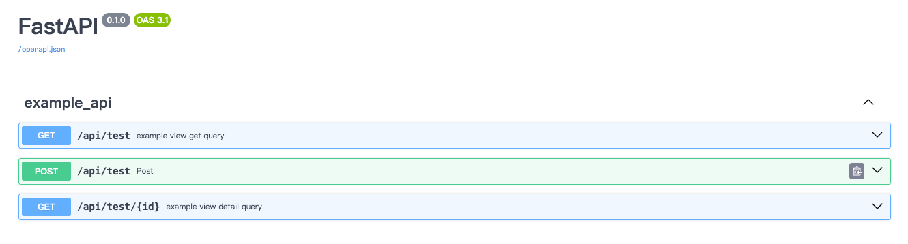
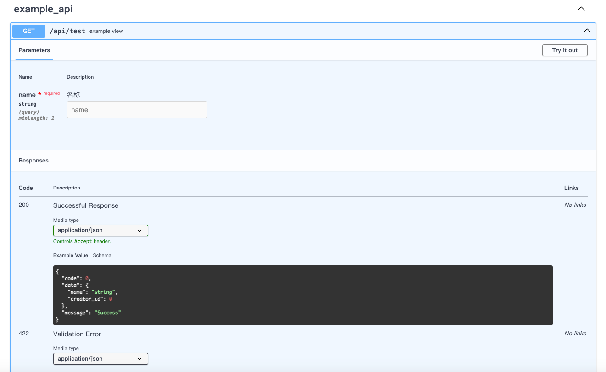

## 简介

`fastapi-build` 是一个强大的 CLI 工具，用于搭建 FastAPI 项目脚手架。受 Django 管理功能的启发，它允许开发者快速设置 FastAPI 应用程序的基本结构和依赖项。提供视图类，仿Django ORM风格操作，自定义错误处理等集成

## 安装
必要条件： python >=3.9
```shell
$ pip install fastapi-build --index-url=https://pypi.org/sample
```

## 快速开始

### 创建新项目

`fbuild startproject` 
```shell
$ fbuild startproject myproject
# 也可以使用 --example-api 添加demo接口示例
$ fbuild startproject --example-api myproject
```

### 创建新应用
`fbuild startapp` 

```shell
$ cd myproject/src
$ fbuild startapp myapp
```

### 添加插件

`fbuild add_plugin `

```shell
$ cd myproject/src
# 当前支持 插件列表 db, db[mysql], db[redis], db[es], migrate, all
$ fbuild add_plugin plugin_name
```

#### 可用插件

- **db**: 提供所有数据库支持
- **db[mysql]**: 提供 MySQL 数据库支持
- **db[redis]**: 提供 Redis 数据库支持
- **db[es]**: 提供 Elasticsearch 支持
- **celery**: 提供 Celery 任务队列支持
- **migrate**: 提供alembic 迁移支持，命令仿照Django makemigrations migrate
- **all**: 安装所有插件

#### 其他命令行
```shell
$ fbuild --help
Usage: fbuild [OPTIONS] COMMAND [ARGS]...

Options:
  --help  Show this message and exit.

Commands:
  startproject    Create project folder
  startapp        To create the app, you need to navigate to the...
  add_plugin      Register a plugin for the application.
  makemigrations  Run the alembic revision, like Django python manage.py makemigrations
  showmigrations  Run the alembic history, like Django python manage.py showmigrations
  migrate         Run the alembic upgrade head, like Django python migrate


```

## 项目结构

由 `fastapi-build` 生成的项目结构概览。

```
├── README.md
├── build
│   ├── Dockerfile
│   └── docker_build.sh
├── requirements.txt
└── src
    ├── api
    │   ├── __init__.py
    │   └── demo
    │       ├── __init__.py
    │       ├── request_schema.py
    │       ├── response_schema.py
    │       ├── urls.py
    │       └── view.py
    ├── auth
    │   ├── __init__.py
    │   ├── authenticate.py
    │   └── hashers.py
    ├── common
    │   ├── __init__.py
    │   ├── load_model.py
    │   ├── log.py
    │   └── patch
    │       ├── __init__.py
    │       └── fastapi_patch.py
    ├── config
    │   ├── __init__.py
    │   ├── dev.py
    │   └── settings.py
    ├── core
    │   ├── __init__.py
    │   ├── base_params.py
    │   ├── base_view.py
    │   ├── decorator.py
    │   └── response.py
    ├── dao
    │   ├── __init__.py
    │   ├── base.py
    │   └── sql_tools.py
    ├── db
    │   ├── backends
    │   │   ├── __init__.py
    │   │   ├── es.py
    │   │   ├── mysql.py
    │   │   └── redis_client.py
    │   └── models
    │       ├── __init__.py
    │       └── base.py
    ├── exceptions
    │   ├── __init__.py
    │   ├── base.py
    │   ├── custom_exception.py
    │   ├── error_code.py
    │   └── http_status.py
    ├── gunicorn_conf.py
    ├── middleware
    │   ├── __init__.py
    │   └── register.py
    └── server.py
```

## 运行项目
```
$ cd src
$ python server.py
INFO:     Started server process [70055]
INFO:     Waiting for application startup.
INFO:     Application startup complete.
INFO:     Uvicorn running on http://127.0.0.1:6100 (Press CTRL+C to quit)


```
访问 http://127.0.0.1:6100/docs 查看文档

## 配置文件
提供了基础的数据库，时区，日志路径等配置,本地开发可以使用 dev.py 覆盖配置
- src/config/settings.py

### 日志配置
**使用loguru管理日志**
- src/common.log.py


## 基于类的视图
1. 创建app: fbuild startapp example_api 
2. 编辑 api/example_api/urls.py
```python
from . import APP_NAME
from core.base_view import path
from .example_view import ExampleView


urlpatterns = [
    path('/test', ExampleView, tags=[APP_NAME])
]
```

3. 编写视图类
api/example_api/view.py
目前支持在 视图类中复写以下函数
 - get, get请求，get查询,不带路径id
 - detail, get请求,根据路径id查询 
 - post, post请求，表单提交
 - query_post, post请求，用于复杂参数的post方式查询
 - put, put请求，根据路径id的表单更新
 - multi_put, put请求，带请求体批量更新
 - delete, delete请求, 根据路径id的删除请求
 - multi_delete, delete请求，带请求体的批量删除
```python
from fastapi import Depends

from .request_schema import UserQueryParams, UserCreateModel, UserLoginModel, UserLoginResponseModel
from .response_schema import UserListResponse, UserItemResponse
from auth.authenticate import login_required
from core.decorator import api_description
from core.base_view import BaseView
from db.models.user import User
from core.response import Res


class DemoView(BaseView):
    method_decorators = [login_required, ]

    @api_description(summary="用户详情", response_model=Res(UserItemResponse))
    async def detail(self, _id: int):
        user = User.objects.get(User.id == _id, raise_not_found=True)
        return self.message(data=user)

    @api_description(summary="用户查询", response_model=Res(UserListResponse))
    async def get(self, query: UserQueryParams = Depends(UserQueryParams)):
        self.request # request对象直接通过self获取
        self.user # 直接获取user对象
        total, users = await User.objects.search(query)
        return self.message(data={'total': total, 'results': users}
```

4. 启动项目
```shell
cd src
python server.py
```
5. 访问接口文档
- 根据app名称分组，接口名称及参数可添加注释，
- 返回结构为 {"code": 0, "data": [], "message": ""} 制作完成




## 仿Django ORM 操作

### 类似 Django 的 ORM

提供的类似 Django 的 ORM 操作的有限集成，例如:

```python
from db.models.base import BaseModel
class User(BaseModel):
    __tablename__ = 'user'
    # you column ...
    
User.objects.get()
await User.objects.aget()

User.objects.create()
await User.objects.a_create()

User.objects.update_by_id()
await User.objects.a_update_by_id()
# ...等其他操作
```

## 中间件
内置了接口信息打印，访问时长记录，跨域CORS，自定义错误返回结构等。
- src/middleware/register.py

## 错误处理
```python
from exceptions.custom_exception import ParamsError
from exceptions.http_status import HTTP_500_INTERNAL_SERVER_ERROR
# 接口中直接使用
async def post(request: Request):
    raise ParamsError(message="username must be string")

# 将返回：
# http_code: 400
res: {"code": 400, "message": "username must be string"}

# 可指定 http_code
ParamsError(message="username must be string", http_code=HTTP_500_INTERNAL_SERVER_ERROR)

# 可自定义错误类
from exceptions.base import ApiError
class ValidatePhoneError(ApiError):
    default_code = ParamCheckError
    default_message = "请输出正确的手机号"
    default_http_code = HTTP_400_BAD_REQUEST

```

## 贡献指南

感谢你对 `fastapi-build` 的贡献！请遵循以下步骤提交你的代码：

1. Fork 此仓库
2. 创建你的特性分支 (`git checkout -b feature/fooBar`)
3. 提交你的更改 (`git commit -am 'Add some fooBar'`)
4. 推送到分支 (`git push origin feature/fooBar`)
5. 创建一个新的 Pull Request

## 许可证

此项目使用 MIT 许可证，详情请参阅 LICENSE 文件。
