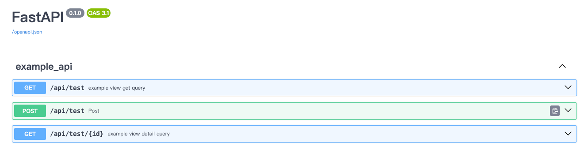
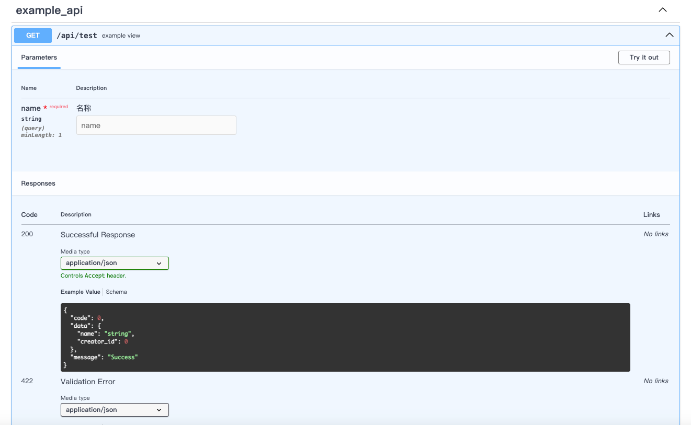

## 目录

## 简介

`fastapi-build` 是一个强大的 CLI 工具，用于搭建 FastAPI 项目脚手架。受 Django 管理功能的启发，它允许开发者：

- 命令行快速设置 FastAPI 应用程序的基本结构和依赖项。
- 提供视图类支持(仿django风格)
- 仿Django ORM风格操作(简化版本,功能有限,基于sqlalchemy)
- 不依赖注入的身份验证，类似djangorestframework 声明式, authentication_classes = []
- 全局的异步sqlalchemy session 对象，await g.session.get(Model, id)
- 仿flask的g变量，g.request, g.user
- 人类可读的pydantic 异常返回

## 安装

必要条件： python >=3.9

```shell
$ pip install fastapi-build --index-url=https://pypi.org/sample
```

## 快速开始

### 创建带api示例的项目
- 命令行创建项目
```shell
fbuild startproject --example-api --all-plugin demo && cd demo/src
# 创建示例api表
fbuild makemigrations
fbuild migrate
```

- 运行项目
```shell
python server.py
```

- 样例路由
```python
# api/demo_user_api/urls.py
from . import APP_NAME
from .view import DemoView
from core.base_view import path

urlpatterns = [
    path('/user', DemoView, tags=[APP_NAME]),
]

```
- 样例接口 
```python
from fastapi import Query, Body

from .request_schema import UserCreateModel
from .response_schema import UserItemResponse
from core.decorator import api_description
from core.base_view import BaseView
from models.user import User
from core.response import Res, ListRes
# from auth.authentication import TokenAuthentication

class DemoView(BaseView):
    # authentication_classes = [TokenAuthentication]
    authentication_classes = []

    @api_description(summary="user detail", response_model=Res(UserItemResponse))
    async def detail(self, _id: int):
        user = await User.objects.aget(User.id == _id, raise_not_found=True)
        # user = User.objects.get(User.id == _id, raise_not_found=True)
        return self.response(data=user)

    async def get(
        self,
        page: int = Query(default=1, ge=1),
        per_page: int = Query(default=10, ge=1),
        search: str = Query(default=""),
        sort: str = Query(default=""),
    ) -> ListRes(UserItemResponse):
        total, data = (
            await User.objects.filter(User.nickname == search)
            .order_by(sort)
            .a_pagination(page, per_page)
        )
        # total, data = User.objects.filter(User.nickname==search).order_by(sort).pagination(page, per_page)
        return self.response(data={"total": total, "items": data})

    @api_description(summary="create user", response_model=Res(UserItemResponse))
    async def post(self, body: UserCreateModel):
        user = await User.objects.a_create(**body.model_dump())
        # user = User.objects.create(**body.model_dump())
        return self.response(data=user)

    @api_description(summary="update user")
    async def put(
        self,
        _id: int,
        nickname: str = Body(..., embed=True),
        email: str = Body(..., embed=True),
    ):
        await User.objects.a_update_by_id(
            _id, properties={"nickname": nickname, "email": email}, raise_not_found=True
        )
        # User.objects.update_by_id(_id, properties={'nickname': nickname, 'email': email}, raise_not_found=True)
        return self.response()

    @api_description(summary="delete user")
    def delete(
        self,
    ): ...

    @api_description(summary="multi put")
    def multi_put(
        self,
    ): ...

    @api_description(summary="multi delete")
    def multi_delete(
        self,
    ): ...


```

## 核心功能
### 全局g变量
- 内置 
1. g.request,
2. g.user, g.user_id, 
3. g.session(异步session), 
4. g.session_sync(同步session)
4. g.extra_data(字典)

```python
from core.context import g
from models import User
from core.decorator import api_description
from core.base_view import BaseView


class DemoView(BaseView):
    @api_description(summary="用户查询", depend_session=True)
    async def get(self, _id):
        # 获取request对象，不依赖手动注入
        g.request
        # 获取user，需要在视图类中声明 authentication_classes = [TokenAuthentication, ]
        g.user, g.user_id
        # 获取 异步session, 需要修改配置 config/settings CREATE_DEPENDS_SESSION=1 或者视图函数中声明 depend_async_session = True
        await g.session.get(User, _id)
        # 其他参数
        g.extra_data['name'] = 1
        g.extra_data['name']
```

### 仿Django ORM 操作

本项目基于SQLAlchemy实现了类似Django的功能，提供了方便的异步和同步API。支持常见的数据库操作如创建、查询、更新、删除，以及更高级的功能比如软删除、分页和聚合。<br>

**注意：**这是一个简化版本，不支持复杂操作如联表查询、外键关系或者使用下划线进行的查询（例如，`field__contains`）。<br>

**核心功能**

- 同步和异步支持：API 兼容同步和异步操作，方便在不同场景下使用。
- 丰富的查询功能：支持条件过滤、排序、分页、聚合等。
- 增删改操作：便捷的对象创建、更新和删除接口。
- 软删除支持：通过软删除标记轻松实现逻辑删除。
- Django 风格 API：接口设计上尽量贴近 Django 的 ORM 使用习惯。
- 
**常用 API 列表**
- 创建：create() / a_create()
- 查询单个对象：get() / aget() / first() / afirst()
- 查询多条记录：filter() / order_by() / values() / avalues()
- 更新：update() / aupdate()
- 删除：delete() / adelete() / soft_delete() / asoft_delete()
- 分页：pagination() / a_pagination()
- 聚合：aggregate()
- 判断记录存在：exists() / aexists()
 
**示例**
```python
from models.base import BaseModel


class User(BaseModel):
    __tablename__ = 'user'
    username = Column(String(32))
    # you column ...


User.objects.get(User.username=="")
await User.objects.aget(User.username=="")

User.objects.create()
await User.objects.a_create()

User.objects.update_by_id()
await User.objects.a_update_by_id()

User.objects.delete_by_id()
await User.objects.a_delete_by_id()

User.objects.filter(User.id >=10, username="test").order_by(User.id.desc()).values(User.username)
await User.objects.filter(User.id >=10, username="test").order_by(User.id.desc()).avalues(User.username)

User.objects.filter(User.id>10).update(username="test")
await User.objects.filter(User.id>10).aupdate(username="test")

User.objects.filter(User.id>10).delete(username="test")
await User.objects.filter(User.id>10).adelete(username="test")

User.objects.filter(User.id >= 10).first()
await User.objects.filter(User.id >= 10).afirst()

User.objects.filter(User.id >= 10).all()
await User.objects.filter(User.id >= 10).a_all()

User.objects.last()
await User.objects.alast()

User.objects.with_columns(User.id, User.username).filter(User.username.like(f"%test%")).limit(10).values_list('username', flat=True)
await User.objects.with_columns(User.id, User.username).filter(User.username.like(f"%test%")).limit(10).avalues_list('username', flat=True)

# ...等其他操作

```


### 基于类的视图

- get, get请求，get查询,不带路径id
- detail, get请求,根据路径id查询
- post, post请求，表单提交
- query_post, post请求，用于复杂参数的post方式查询
- put, put请求，根据路径id的表单更新
- multi_put, put请求，带请求体批量更新
- delete, delete请求, 根据路径id的删除请求
- multi_delete, delete请求，带请求体的批量删除

```python
class DemoView():
    def get(self, *args, **kwargs):
        raise ImportError("Not implemented")

    def detail(self, *args, **kwargs):
        raise ImportError("Not implemented")

    def post(self, *args, **kwargs):
        raise ImportError("Not implemented")

    def query_post(self, *args, **kwargs):
        raise ImportError("Not implemented")

    def put(self, *args, **kwargs):
        raise ImportError("Not implemented")

    def multi_put(self, *args, **kwargs):
        raise ImportError("Not implemented")

    def delete(self, *args, **kwargs):
        raise ImportError("Not implemented")

    def multi_delete(self, *args, **kwargs):
        raise ImportError("Not implemented")
```

### 可全局访问的同步异步session
- 同步 session
```python
from core.context import g
g.session_sync.query()
g.session_sync.add()
...

```
- 异步session
1. 非注入方式(推荐)

```python
from core.context import g
from core.base_view import BaseView


class DemoView(BaseView):
    async def detail(self, _id: int):
        data = await g.session.query(...)
        return self.response(data=data)
```
2. 注入方式

 ```python
from db.database import session_type
from core.base_view import BaseView


class DemoView(BaseView):
    async def detail(self, _id: int, session: session_type):
        data = await session.query(...)
        return self.response(data=data)
```
3. 手动创建方式

```python
from db.database import sessionmanager

from core.base_view import BaseView


class DemoView(BaseView):
    async def detail(self, _id: int):
        async with sessionmanager.session() as session:
            await session.add


```

**注意⚠️：** 
- 全局变量方式使用session(g.session, g.session_sync), 需配置 CREATE_DEPENDS_SESSION=1，否则需要每个接口声明 depend_session=True, 位置: config/settings.py CREATE_DEPENDS_SESSION=1
- 或者每个接口声明
```python
@api_description(summary="用户查询",  depend_session=True)
async def get(self, _id): 
   ...
```


### 声明式身份验证
1. 定义身份验证类
 - **需要实现同步异步两个方法**

```python
from fastapi import Request

from auth.base_authentication import BaseTokenAuthentication
from models import User


class TokenAuthentication(BaseTokenAuthentication):

    async def authenticate(self, request: Request):
        user_info = self.validate_token(request)
        user = await User.objects.aget_by_id(user_info['user_id'])
        # 需要返回 user，可以是 pydantic 对象，可以是 sqlalchemy对象
        return user

    def authenticate_sync(self, request: Request):
        user_info = self.validate_token(request)
        user = User.objects.get_by_id(user_info['user_id'])
        # 需要返回 user，可以是 pydantic 对象，可以是 sqlalchemy对象
        return user
```
2. 视图类中声明
- 如果需要全局设置，可以修改BaseView  authentication_classes
- 可以为每个视图函数单独指定验证类, @api_description(authentication_classes=[])
- 通过验证后可以在 视图函数或者g变量中访问 user
```python
from core.context import g
class DemoView(BaseView):
    authentication_classes = [TokenAuthentication, ]

    @api_description(summary="用户详情", response_model=Res(UserItemResponse))
    async def detail(self, _id: int):
        user = User.objects.aget(User.id == _id, raise_not_found=True)
        return self.message(data=user)

    @api_description(summary="用户查询", response_model=Res(UserListResponse), authentication_classes=[])
    def get(self, query: UserQueryParams = Depends(UserQueryParams)):
        self.request  # request对象直接通过self获取
        self.user  # 直接获取user对象
        g.user 
        total, users = User.objects.search(query)
        return self.message(data={'total': total, 'results': users}
```

### 添加插件

`fbuild add_plugin `

```shell
$ cd myproject/src
# 当前支持 插件列表 db, db[database], db[redis], db[es], migrate, all
$ fbuild add_plugin plugin_name
$ fbuild add_plugin 'db[database]'
$ fbuild add_plugin 'db[es]'
$ fbuild add_plugin all
```

#### 可用插件

- **db**: 提供所有数据库支持
- **db[database]**: 提供 database 数据库支持
- **db[redis]**: 提供 Redis 数据库支持
- **db[es]**: 提供 Elasticsearch 支持
- **celery**: 提供 Celery 任务队列支持
- **migrate**: 提供alembic 迁移支持，命令仿照Django makemigrations migrate
- **all**: 安装所有插件

#### 其他命令行

```shell
$ fbuild --help
Usage: fbuild [OPTIONS] COMMAND [ARGS]...

Options:
  --help  Show this message and exit.

Commands:
  startproject    Create project folder
  startapp        To create the app, you need to navigate to the...
  add_plugin      Register a plugin for the application.
  makemigrations  Run the alembic revision, like Django python manage.py makemigrations
  showmigrations  Run the alembic history, like Django python manage.py showmigrations
  migrate         Run the alembic upgrade head, like Django python migrate


```

### 中间件

内置了接口信息打印，访问时长记录，跨域CORS，自定义错误返回结构等。

- src/middleware/middle.py

### 配置文件

提供了基础的数据库，时区，日志路径等配置,本地开发可以使用 dev.py 覆盖配置

- src/config/settings.py

### 日志配置

**使用loguru管理日志**

- src/common.log.py

### 错误处理
- 人类可读的异常信息
 


- 自定义接口异常
```python
from exceptions.custom_exception import ParamsError
from exceptions.http_status import HTTP_500_INTERNAL_SERVER_ERROR


# 接口中直接使用
async def post(request: Request):
    raise ParamsError(message="username must be string")


# 将返回：
# http_code: 400
res: {"code": 400, "message": "username must be string"}

# 可指定 http_code
ParamsError(message="username must be string", http_code=HTTP_500_INTERNAL_SERVER_ERROR)

# 可自定义错误类
from exceptions.base import ApiError


class ValidatePhoneError(ApiError):
    default_code = ParamCheckError
    default_message = "请输出正确的手机号"
    default_http_code = HTTP_400_BAD_REQUEST

```

### 启动项目

```shell
cd src
python server.py
```

### 访问接口文档

- 根据app名称分组，接口名称及参数可添加注释，
- 返回结构为 {"code": 0, "data": [], "message": ""} 制作完成
  
  

### 项目结构

由 `fastapi-build` 生成的项目结构概览。

```
├── README.md
├── build
│   ├── Dockerfile
│   └── docker_build.sh
├── requirements.txt
└── src
    ├── api
    │   ├── __init__.py
    │   └── demo
    │       ├── __init__.py
    │       ├── request_schema.py
    │       ├── response_schema.py
    │       ├── urls.py
    │       └── view.py
    ├── auth
    │   ├── __init__.py
    │   ├── authentication.py
    │   ├── base_authentication.py
    │   ├── base_permission.py
    │   └── hashers.py
    ├── common
    │   ├── __init__.py
    │   ├── load_model.py
    │   ├── log.py
    │   └── patch
    │       ├── __init__.py
    │       └── fastapi_patch.py
    ├── config
    │   ├── __init__.py
    │   ├── dev.py
    │   └── settings.py
    ├── core
    │   ├── __init__.py
    │   ├── base_params.py
    │   ├── base_view.py
    │   ├── context.py
    │   ├── decorator.py
    │   └── response.py
    ├── dao
    │   ├── __init__.py
    │   ├── base.py
    │   └── sql_tools.py
    ├── db
    │   ├── backends
    │   │   ├── __init__.py
    │   │   ├── es.py
    │   │   ├── mysql.py
    │   │   └── redis_client.py
    │   └── models
    │       ├── __init__.py
    │       └── base.py
    ├── exceptions
    │   ├── __init__.py
    │   ├── base.py
    │   ├── custom_exception.py
    │   ├── error_code.py
    │   └── http_status.py
    ├── gunicorn_conf.py
    ├── middleware
    │   ├── __init__.py
    │   └── register.py
    └── server.py
```

### 贡献指南

感谢你对 `fastapi-build` 的贡献！请遵循以下步骤提交你的代码：

1. Fork 此仓库
2. 创建你的特性分支 (`git checkout -b feature/fooBar`)
3. 提交你的更改 (`git commit -am 'Add some fooBar'`)
4. 推送到分支 (`git push origin feature/fooBar`)
5. 创建一个新的 Pull Request

### 许可证

此项目使用 MIT 许可证，详情请参阅 LICENSE 文件。
